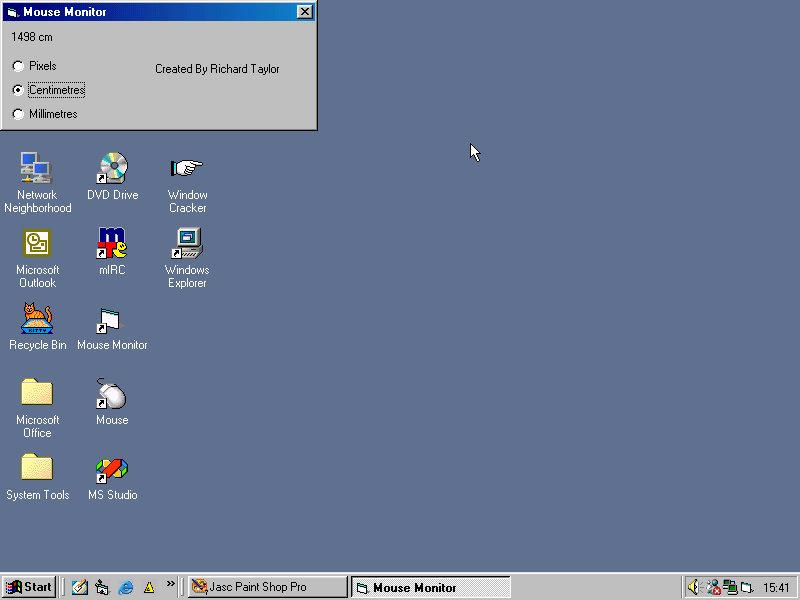



## Mouse Monitor NEVER BEFORE\!

### Description

Ive not seen this on PScode before (so if u have please tell me ;) )

It measures how far your mouse travels in pixels, cm and mm - it sits in the system tray so you dont have to see the form, it gets the old mousex, new mouseX and gets the difference for all the directions and adds it to the value. You can load the form at any time to see the update and check how far youve got - it stores the distance in the registry :), if you like this please please vote and leave feedback saying what you like about it :), i'll probably update this within a few weeks to store a log on mouse clicks and keyboard events but that depends if anyone likes this one first :)
 
### More Info
 

             |
---                |---
**Submitted On**   |2002-02-23 17:33:04
**By**             |[Richard Taylor](https://github.com/Planet-Source-Code/PSCIndex/blob/master/ByAuthor/richard-taylor.md)
**Level**          |Beginner
**User Rating**    |4.3 (34 globes from 8 users)
**Compatibility**  |VB 3\.0, VB 4\.0 \(16\-bit\), VB 4\.0 \(32\-bit\), VB 5\.0, VB 6\.0, VB Script, ASP \(Active Server Pages\) , VBA MS Access, VBA MS Excel
**Category**       |[Miscellaneous](https://github.com/Planet-Source-Code/PSCIndex/blob/master/ByCategory/miscellaneous__1-1.md)
**World**          |[Visual Basic](https://github.com/Planet-Source-Code/PSCIndex/blob/master/ByWorld/visual-basic.md)
**Archive File**   |[Mouse\_Moni570362232002\.zip](https://github.com/Planet-Source-Code/richard-taylor-mouse-monitor-never-before__1-32059/archive/master.zip)

